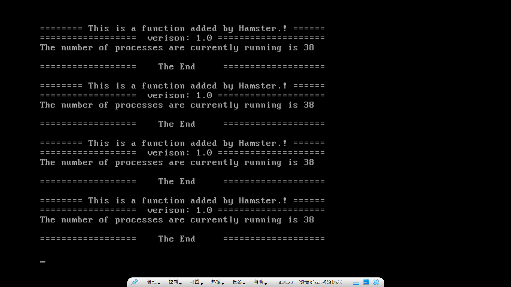

# ECE4820J HW 2

> Author: :hamster:

### Ex 1

1. all waiting: $P = p\times \dots \times p = p^n$

   utilization: $1-p^n$

2.  

3. + RAM left = 256 - 96 = 160 MB $\Rightarrow$ at most 3 processes

   + utilization: $1-{0.9}^3 \times 100\%= 27.1\%$

   + | RAM     | RAM for processes | processes number | CPU utilization | CPU / RAM |
     | ------- | ----------------- | ---------------- | --------------- | --------- |
     | 256 MB  | 160 MB            | 3                | 27.1%           | 0.106 %   |
     | 512 MB  | 416 MB            | 8                | 57.0%           | 0.111 %   |
     | 1024 MB | 928 MB            | 19               | 86.5%           | 0.084 %   |

   + To save money, investigate the 256 MB RAM (?)
   
   + To have best experience, investigate 1024 MB RAM
   
   + To optimize CPU use compared to the RAM size, investigate 512 MB.

### Ex 2

Steps:

1. Files need to be modified: Under`/usr/src/servers/is`

   + `proto.h`: add declaration `void countproc_dmp(void);`

   + `dmp.c`: in the struct `hook_entry`, add one line`{ SF7,  countproc_dmp, "Display how many processes are currently running" },`

   + `dmp_fs.c`: add function `countproc_dmp()`

   + ```C
     void countproc_dmp(){
     	printf("======== This is a function added by Hamster.! ======\n");
     	printf("==================  verison: 1.0 ====================\n");
     	struct mproc *mp;
         int i,n=0;
         if(getsysinfo(PM_PROC_NR, SI_PROC_TAB, mproc, sizeof(mproc))!=OK){
           printf("Error obtaining table from PM. Perhaps recompile IS?\n");
           return;
         }
         for(i=0;i<NR_PROCS;i++){
           mp=&mproc[i];
           if(mp->mp_pid==0 && i!=PM_PROC_NR) continue;
           n++;
         }
     	printf("The number of processes are currently running is %d\n", n);
     	printf("\n==================    The End     ===================\n\n");
     }
     ```

2. Compile and build

   ```bash
   cd /usr/src
   make build
   ```

   Then restart the system.

3. Test

   Press `Shift + F5`, you can see:

   

Then press `Shift + F7`:


