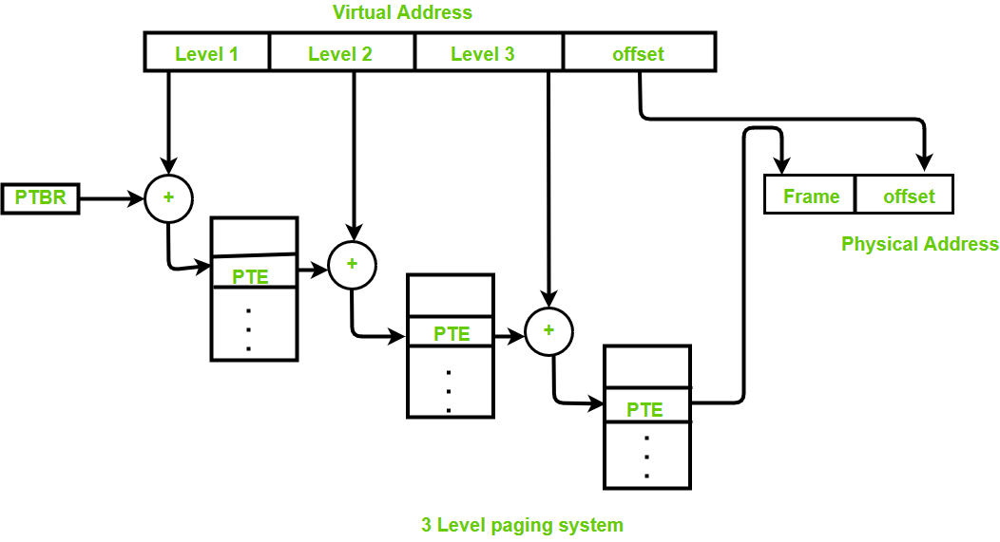

# ECE4820J Homework 6

> Author: :hamster:

### Ex 1

1. + Apply first fit:
     + 12 KB -> 20 KB
     + 10 KB -> 10 KB
     + 9 KB -> 18 KB
   + Apply best fit:
     + 12 KB -> 12 KB
     + 10 KB -> 10 KB
     + 9 KB -> 9 KB
   + Apply quick fit:
     + 12 KB -> 12 KB
     + 10 KB -> 10 KB
     + 9 KB -> 9 KB

2. Effective instruction time: 
   $$
   10 + \frac{n}{k} ~\text{[sec]}
   $$

3.  After 8 clock tics:
   + page 0: 0110 1110
   + page 1: 0100 1001
   + page 2: 0011 0111
   + page 3: 1000 1011

### Ex 2

#### Inverted Page Table

> https://www.geeksforgeeks.org/inverted-page-table-in-operating-system/


To solve the issue that a large process may takes up too much page table, the inverted page table is invented. Through the inverted page table, the overhead of storing an individual  page table for every process gets eliminated and **only a fixed portion of memory** is required to store **the paging information of all the processes** together. This technique is called inverted paging as the indexing is  done with respect to the frame number instead of the logical page  number. 

+ Pros: Reduced memory space.
+ Cons: Longer loop up time; Difficult shared memory implementation.

#### Multilevel Page Table

> https://www.geeksforgeeks.org/multilevel-paging-in-operating-system/



Multilevel page table is to solve the issue that some protection bit such as the dirty bit wastes too much memory. In multilevel paging, **only the outer most** page table will reside **in the main memory** and other page tables will be brought to main memory as per the requirement because **at a particular time we do not need complete page table**, also we can save much memory space because outermost page table can fit in exactly one frame.

The disadvantage is that extra memory references is needed to access address translation tables, which can slow programs down by a factor of two or more. Translation look aside buffer (TLB) could be used to speed up address translation by storing page table entries. 

### Ex 3

> https://en.wikipedia.org/wiki/Security_bug

The most common software holes are caused by software flaws - configuration or coding errors. Including:

+ [Memory safety](https://en.wikipedia.org/wiki/Memory_safety) (e.g. [buffer overflow](https://en.wikipedia.org/wiki/Buffer_overflow) and [dangling pointer](https://en.wikipedia.org/wiki/Dangling_pointer) bugs)
+ [Race condition](https://en.wikipedia.org/wiki/Race_condition)
+ Secure input and output handling
+ Faulty use of an [API](https://en.wikipedia.org/wiki/API)
+ Improper [use case](https://en.wikipedia.org/wiki/Use_case) handling
+ Improper [exception handling](https://en.wikipedia.org/wiki/Exception_handling)
+ [Resource leaks](https://en.wikipedia.org/wiki/Resource_leak), often but not always due to improper exception handling
+ Preprocessing input strings before they are checked for being acceptable

> https://www.squarefree.com/2006/11/01/memory-safety-bugs-in-c-code/#:~:text=As%20a%20result%2C%20it%20is%20easy%20to%20have,They%27re%20also%20usually%20exploitable%20to%20run%20arbitrary%20code.

Take dangling pointers as an example, a simple read from a dangling pointer usually won't cause too much damage. But writing to a dangling pointer can corrupt another data structure, and freeing a dangling pointer can leave another data structure open to future corruption. What's worse, calling a virtual member function on a dangling pointer will jump to a memory location based on a virtual-function-table pointer that is likely to have been overwritten, easily leading to arbitrary code execution. 

### Ex 4

See also `thrashing.c`.

```C
#include <stdlib.h>
#include <stdio.h>
#include <unistd.h>
int main(){
    int i = 0;
    int * large_array = NULL;

    while ( 1 ) {
        usleep(1);
        large_array = malloc(sizeof(int)*10000000);
        printf("%d-th times of allocation: %lld\n",++i,(long long)large_array);
    }

    return 0;
}
```

when out of memory: the output might be:


