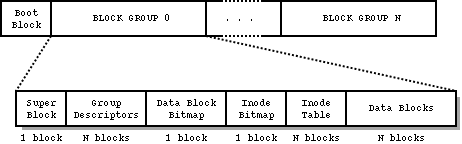

# ECE4820J Homework 7

> Author: :hamster:

### Ex 1

1. All the reference bits will be set to be zero, the others remain the same.

2. | Page | Time Stamp | Present | Referenced | Modified |
   | :--: | :--------: | :-----: | :--------: | :------: |
   |  0   |     6      |    1    |     0      |    1     |
   |  1   |     9      |    1    |     0      |    0     |
   |  2   |     9      |    1    |     0      |    1     |
   |  3   |     10     |    1    |     0      |    0     |
   |  4   |     4      |    0    |     0      |    0     |
   

### Ex 2

1. constant numbers and corresponding system calls can be found in `src/include/minix/callnr.h`

   ```C
   #define NCALLS		 114	/* number of system calls allowed */
   
   /* In case it isn't obvious enough: this list is sorted numerically. */
   #define EXIT		   1 
   #define FORK		   2 
   #define READ		   3 
   #define WRITE		   4 
   #define OPEN		   5    
   ```

2. table used to map system call numbers onto the routines is stored in `servers/pm/table.c`

   ```C
   int (*call_vec[])(void) = {
   	no_sys,		/*  0 = unused	*/
   	do_exit,	/*  1 = exit	*/
   	do_fork,	/*  2 = fork	*/
       ...
   }
   ```
3. the protos are stored in `servers/pm/proto.h`

   ```C
   /* forkexit.c */
   int do_fork(void);
   int do_srv_fork(void);
   int do_exit(void);
   void exit_proc(struct mproc *rmp, int exit_status, int dump_core);
   void exit_restart(struct mproc *rmp, int dump_core);
   int do_waitpid(void);
   int wait_test(struct mproc *rmp, struct mproc *child);
   ```

4. system calls of type "signal" are coded in `src/pm/signal.c`

   ```C
   /* This file handles signals, which are asynchronous events and are generally
    * a messy and unpleasant business.  Signals can be generated by the KILL
    * system call, or from the keyboard (SIGINT) or from the clock (SIGALRM).
    * In all cases control eventually passes to check_sig() to see which processes
    * can be signaled.  The actual signaling is done by sig_proc().
    */
   ```

5. ```C
   #include "pm.h"
   #include "mproc.h"
   int getnchpid(int n, pid_t *childpid) {
       if ( n > NR_PROCS ) return -1;
   	struct mproc * p = mproc + n; 
   	if (p->mp_parent != who_p) return -2;
   	*childpid = rmc->mp_pid;
   	return 0;
   }
   ```

6. ```C
   #include "pm.h"
   #include "mproc.h"
   int do_getchpids(int n, pid_t *childpid) {
   	for (int i = 0; i < n; i++)
   		if (getnchpid(i, childpid+i) == -1)
   			return -1;
      		else (getnchpid(i, childpid+i) == -2)
               return i+1;
   	return n;
   }
   ```

7. ```C
   #include <stdlib.h>
   #include <stdio.h>
   #include <syss/wait.h>
   
   #define NUM 5
   
   int main(){
   	pid_t child_pid[NUM];
   	pid_t ret_pid[NUM];
   	for (size_t i = 0; i < NUM; i++) {
   		pid_t pid = fork();
   		if (pid == 0) {
               printf("This is a child, pid = %d\n",pid);
               exit(0);
   		} else {
               child_pid[i] = pid;
               wait(NULL);
           }	
   	}
   	printf("Checking...\n");
   	if (getchpids(NUM, ret_pid) != 0){
   		for (size_t i = 0; i < NUM; i++)
   			printf("getchpids: %d, fork: %d\n", ret_pid[i], child_pid[i]);
       } else {
           fprintf(stderr,"Get child pid failed\n");
       }
       return 0;
   }
   ```

8. + **Pros**: Easy to be reused by other function / system calls.
   + **Cons**: Add another layer, slower.
   + **Alternative**: Pass an array large enough and return all the pids as well as the number of the child processes once.

### Ex 3: ext2 file system

> https://wiki.osdev.org/Ext2

Ext2 is short for *the second extented* file system. It is a rewrite of the original *Extended Filesystem* and as such, is also based around the concept of **inodes**. Ext2 served as the de facto filesystem of Linux for nearly a decade from the early 1990s to the early 2000s when it was superseded by the journaling file systems [ext3](https://wiki.osdev.org/Ext3) and [ReiserFS](https://wiki.osdev.org/ReiserFS). 

It has native support for **UNIX ownership / access rights**, **symbolic- and hard-links**, and other properties that are common among UNIX-like operating systems. Organizationally, it divides disk space up into groups called **block groups**. Having these groups results in distribution of data across the disk which helps to minimize head movement as well as the impact of **fragmentation**. 

Ext2 is built on the premise that the data held in files is kept in data blocks. The Figure below shows the layout of the EXT2 file system as occupying a series of blocks in a block structured device. 

The Ext2 file system divides up disk space into logical blocks of contiguous space. The size of blocks need not be the same size as the sector size of the disk the file system resides on. The size of blocks can be determined by reading the field starting at byte 24 in the [Superblock](https://wiki.osdev.org/Ext2#Superblock).

Blocks, along with inodes, are divided up into **block groups**. These are nothing more than contiguous groups of blocks. Each block group reserves a few of its blocks for special purposes such as:

- A bitmap of free/allocated blocks within the group
- A bitmap of allocated inodes within the group
- A table of inode structures that belong to the group
- Depending upon the revision of Ext2 used, some or all block groups may also contain a backup copy of the [Superblock](https://wiki.osdev.org/Ext2#Superblock) and the [Block Group Descriptor Table](https://wiki.osdev.org/Ext2#Block_Group_Descriptor_Table).

> https://www.science.smith.edu/~nhowe/teaching/csc262/oldlabs/ext2.html



> https://www.diskinternals.com/glossary/ext2/

The ext2 file system has a maximum data size of 4 terabytes, maximum filename length of 255 characters, and has variable length block size. However, other operating system considerations may mean that this full size is often not realizable on any particular operating system. On Linux, for example, restrictions in the block driver mean that ext2 filesystems have a maximum data size of 2047 gigabytes.

### Ex 4

1. No. Only the read-only pages can be shared. Once a child process write the process, there will be two copies of the pages. They can no longer be shared.
2. No. The match line can contain both the segment and the page number.

