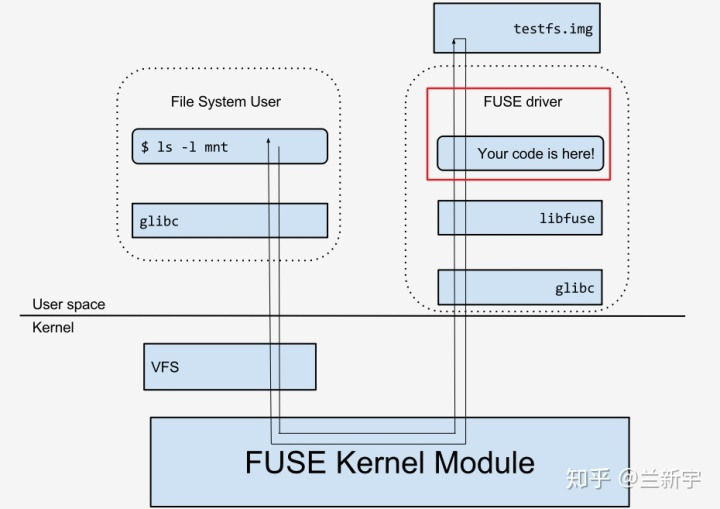

# ECE4820J Lab 11

> Author: :hamster: + :car:
>
> LAST LAB!!

### File System

> https://www.freecodecamp.org/news/file-systems-architecture-explained/
>
> https://en.wikipedia.org/wiki/File_system

A  **file system** defines how files are  **named**,  **stored**, and  **retrieved** from a storage device. Taking its name from the way a paper-based data management system is named, each group of data is called a "[file](https://en.wikipedia.org/wiki/Computer_file)". The structure and logic rules used to manage the groups of data and their names is called a "file system."

### Linux VFS

> https://www.starlab.io/blog/introduction-to-the-linux-virtual-filesystem-vfs-part-i-a-high-level-tour

The VFS acts as the **interface** between the user and the file’s backing filesystem, masking any implementation details behind generic calls such as `open()`, `read()`, `write()`, etc. The primary benefit of the VFS is that most user-space programs are naturally written in a completely filesystem-agnostic way granting greater flexibility and portability in ways that the original author of the program likely never envisioned. An interesting byproduct of this is that it also allows any number of filesystems to coexist in a unified namespace. 


### Fuse

> https://www.linux.org/threads/fuse.10371/

Fuse stands for File System in User Space. An open source framework for implementing file systems in user-space. FUSE also aims to provide a secure method for non-privileged users to create and mount their own filesystem implementations.
FUSE not only mounts virtual filesystems, but also "real" filesystems like `ZFS` and `exFAT`. FUSE can also mount files like ISOs, CD track files, and compressed files (zip, gzip, tar, etc.). FUSE's abilities extend to network filesystems like `HTTP-FS`, `aptfs`, and others. FUSE can also be used to transfer files to Apple devices like the ipod and iphone (iFUSE). 



### SSHFS

SSHFS stands for SSH File System.

> https://en.wikipedia.org/wiki/SSHFS

**SSHFS** (**SSH Filesystem**) is a file system client to mount and interact with directories and files that located on a remote ssh connection. SFTP provides secure file transfer from a remote file system. While SFTP clients can transfer files and directories, they cannot mount the server's file system into the local directory tree. Using SSHFS, a remote file system may be treated in the same way as other volumes (such as hard drives or removable media). 

#### Benefit

The **advantage** of SSHFS when compared to other network file system protocols is that, given that a user already has SSH access to a host, it does not require any additional configuration work, or the opening of additional entry ports in a firewall.

#### Usage

1. install the client

```bash
sudo apt-get install sshfs
```

2. create a file in local computer

```bash
sudo mkdir ~/Lemondb
```

3. mount

```bash
sudo sshfs -o allow_other,default_permissions 520370910026@111.186.59.59:~/ ~/Lemondb
```


