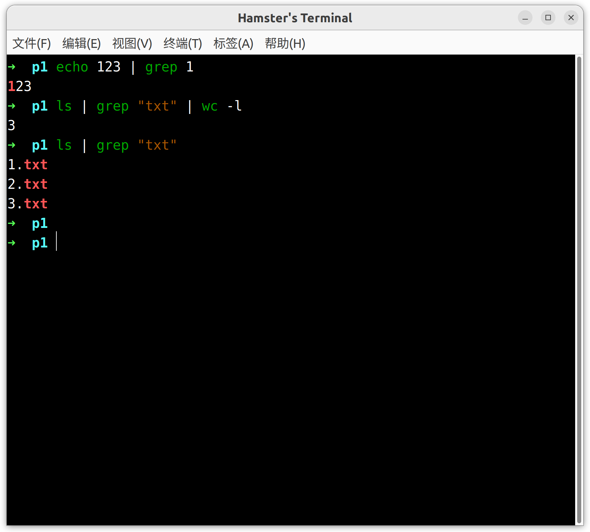

## Pipe

> Presenter: :fish: + :hamster:

### Definition

​	Pipe is a type of **redirection** utilized for transfer the std out of one command to a destination or other command. The **Linux** systems permit the std out to be connected with the stdin of the other command. In Linux, pipes are represented using the “**|**” pipe character.

### Manual

```
       pipe() creates a pipe, a unidirectional data channel that can
       be used for interprocess communication.  The array pipefd  is
       used  to return two file descriptors referring to the ends of
       the pipe.  pipefd[0] refers to the  read  end  of  the  pipe.
       pipefd[1]  refers to the write end of the pipe.  Data written
       to the write end of the pipe is buffered by the kernel  until
       it  is  read  from the read end of the pipe.  For further de‐
       tails, see pipe(7).
```

### Basic Usage

`exe1 | exe2` . Connects the `stdout` of exe1 to `stdin` of exe2.

```
echo 123 | grep 1
```

This will show you the text having "1" and the key word "1" is highlighted.

```
ls | grep "txt" | wc -l
```

The output of the command will print out the total number of files containing the “**txt**” pattern



### Example Code

```C++
#include <stdio.h>
#include <unistd.h>
#include <string.h>

int main() {
	int fd[2];
	if (pipe(fd) == -1) {
		fprintf(stdout, "Can not create pipe.\n");
		_exit(1);
	}

	pid_t pid = fork();
	if (pid < 0) {
		fprintf(stdout, "Fork failure\n");
	} else if (pid == 0) {  
		close(fd[0]);  
		char str[] = "message";  
		write(fd[1], str, strlen(str));
	} else {   
		close(fd[1]);
		char str[100];
		read(fd[0], str, 100);
		fprintf(stdout, "Parent: read data from pipeline (%s)", str);
	}

    return 0;
}

```

