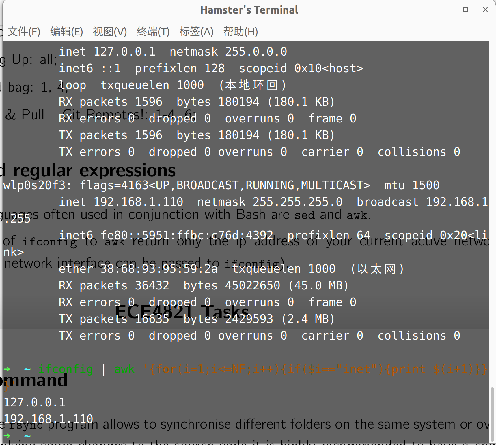

# ECE4820J Lab 3

> Author: :hamster:

### Ex 2

+ Edit a file in `/usr/src`: 

  ```bash
  echo hamster > /usr/src/temp
  echo "hamster is cute.!" > /usr/src/temp
  ```

+ Create a patch

  ```bash
  sudo diff -acrN /usr/src_orig /usr/src > patch
  ```
  
+ Apply patch

  ```bash
  patch -p3 /usr/src/temp < patch
  ```
  
+ Revert

  ```bash
  patch -RE -p3 < patch
  ```

### Ex 3

+ IP Address:

  ```bash
  ifconfig | awk '{for(i=1;i<=NF;i++){if($i=="inet"){print $(i+1)}}}'
  ```

  