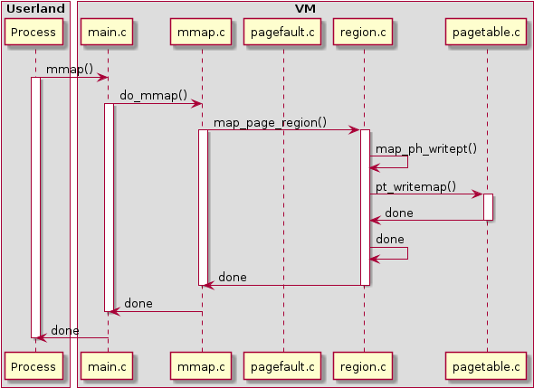
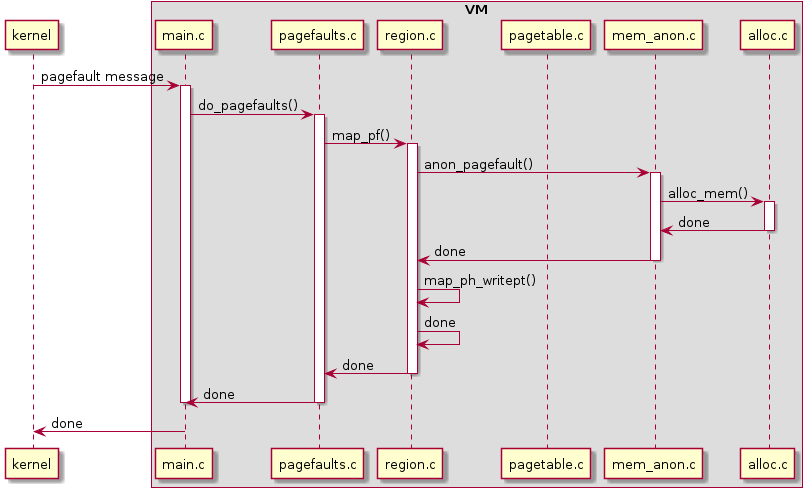
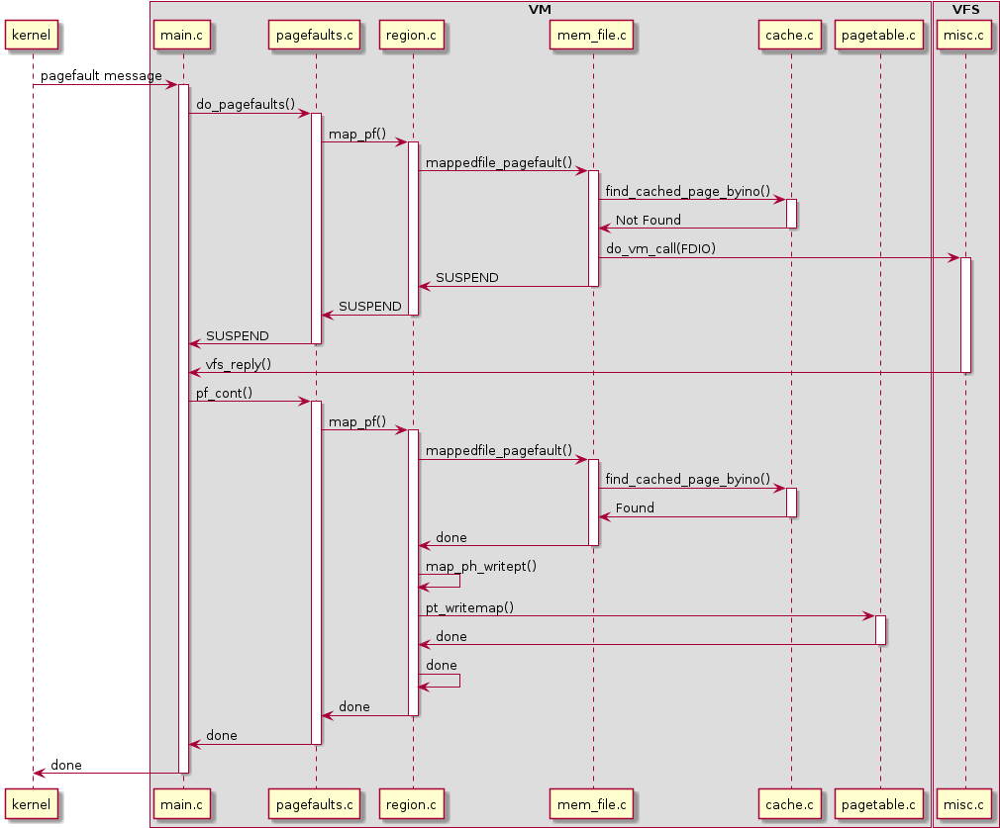

# ECE4820J Lab 8

> Author: :hamster:

1. `vm` stands for virtual memory.

2. In minix kernel source code, page table is defined in `src/servers/vm/pt.h`. Here is the entry:

   ```C
   /* A pagetable. */
   typedef struct {
   	/* Directory entries in VM addr space - root of page table.  */
   	u32_t *pt_dir;		/* page aligned (ARCH_VM_DIR_ENTRIES) */
   	u32_t pt_dir_phys;	/* physical address of pt_dir */
   
   	/* Pointers to page tables in VM address space. */
   	u32_t *pt_pt[ARCH_VM_DIR_ENTRIES];
   
   	/* When looking for a hole in virtual address space, start
   	 * looking here. This is in linear addresses, i.e.,
   	 * not as the process sees it but the position in the page
   	 * page table. This is just a hint.
   	 */
   	u32_t pt_virtop;
   } pt_t;
   ```

3. All the basic function handling virtual memory can be found in `vm/proto.h`.

   ```C
   /* $(ARCH)/pagetable.c */
   void pt_init();
   void vm_freepages(vir_bytes vir, int pages);
   void pt_init_mem(void);
   void pt_check(struct vmproc *vmp);
   int pt_new(pt_t *pt);
   void pt_free(pt_t *pt);
   int pt_map_in_range(struct vmproc *src_vmp, struct vmproc *dst_vmp,
   	vir_bytes start, vir_bytes end);
   int pt_ptmap(struct vmproc *src_vmp, struct vmproc *dst_vmp);
   int pt_ptalloc_in_range(pt_t *pt, vir_bytes start, vir_bytes end, u32_t
   	flags, int verify);
   void pt_clearmapcache(void);
   int pt_writemap(struct vmproc * vmp, pt_t *pt, vir_bytes v, phys_bytes
   	physaddr, size_t bytes, u32_t flags, u32_t writemapflags);
   int pt_checkrange(pt_t *pt, vir_bytes v, size_t bytes, int write);
   int pt_bind(pt_t *pt, struct vmproc *who);
   void *vm_allocpage(phys_bytes *p, int cat);
   void *vm_allocpages(phys_bytes *p, int cat, int pages);
   void *vm_allocpagedir(phys_bytes *p);
   void pt_cycle(void);
   int pt_mapkernel(pt_t *pt);
   void vm_pagelock(void *vir, int lockflag);
   int vm_addrok(void *vir, int write);
   int get_vm_self_pages(void);
   ```

4.  Commands to find all `vm`:

   ```bash
   find /usr/src -name "*.c"| xargs grep -l "vm"> vm.log
   ```

   there are in total 300 files found.

   Virtual memory is widely used in different scenarios, whenever there is a need to transfer pages of data from random access memory to disk storage, the keyword `vm` would occur.

5. In the kernel, small chunks can be allocated using `kmalloc`  while large virtually contiguous areas can be allocated with  `vmalloc`.

   The `malloc` and `calloc` is not defined in the kernel, since they are defined in user libraries.

6.  From minix wiki

   > https://wiki.minix3.org/doku.php?id=developersguide:vminternals

   A typical flow of control is

   - Receive message in main.c
   - Do call-specific work in call-specific file, e.g. mmap.c, cache.c
   - This manipulates high-level data structures by invoking functions in region.c
   - This updates the process pagetable by invoking functions in pagetable.c

   

​	Clearly, the function `mmap()` cross the boundary between vm and the userland.

​	**Tradeoff**: `vm` in kernel space can more provide memory protection, but crossing the boundary between user space and kernel space is time and resource consuming. On the country, `vm` in user space is faster but not safer.

7. **page fault** handling:

   Pagefaults are memory-type specific. How a pagefault in anonymous memory might look:

   

   + If a page fault is in a file-mapped region, the cache is queried for the presence of the right block. 

   + If it isn't there, a request to VFS will have to happen asynchronously for the block to appear in the cache. Once VFS indicates the request is complete, the page fault code is simply re-invoked the same way.

   
