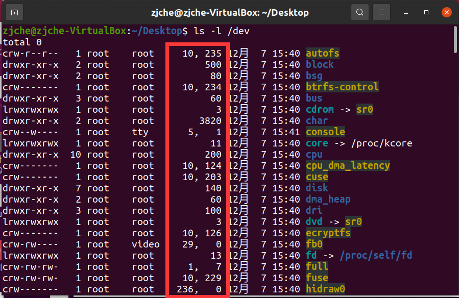

# ECE4820J Lab 9

> Author: :car:

### 1: What needs to be returned by read and write file operations for a character device?

If success, `read` and `write` returns the bytes read or written. If an error occurs, return -1.

### 2: How are exactly those major and minor numbers working? You vaguely remember that you can display them using `ls -l /dev`.
The major number identifies the driver associated with the device. The minor number is used only by the driver specified by the major number; It is common for a driver to control several devices, and the minor number provides a way for the driver to differentiate among them. Here the minor number represents the type of dice to throw.
By typing the command `ls -l /dev`, we can see two columns of numbers here. The left number is the major number, and the right one is the minor number.


### 3: Knowing the major number and minor numbers of a device, how to add a character device to `/dev`?
`mknod /dev/$name c $major $minor`

### 4: Where are the following terms located in linux source code?
module_init: `include/linux/module.h`
module_exit: `include/linux/module.h`
printk: `include/linux/printk.h`
container_of: `include/linux/kernel.h`
dev_t: `include/linux/types.h`
MAJOR: `include/linux/kdev_t.h`
MINOR: `include/linux/kdev_t.h`
MKDEV: `include/linux/kdev_t.h`
alloc_chrdev_region: `fs/char_dev.c`
module_param: `include/linux/moduleparam.h`
cdev_init: `fs/char_dev.c`
cdev_add: `fs/char_dev.c`
cdev_del: `fs/char_dev.c`
THIS_MODULE: `include/linux/export.h`

### 4: How to generate random numbers when working inside the Linux kernel? You think that a while back you read something about getting the current time.
```c
#include <sys/random.h>
ssize_t getrandom (void *__buffer, size_t __length, unsigned int __flags) __wur;
```

### 5: How to define and specify module options?
```c
static long my_ioctl (struct file *file, unsigned int cmd, unsigned long arg);
```
